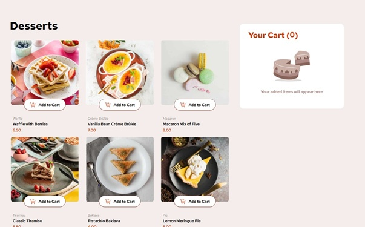

# Frontend Mentor - Product list with cart solution

This is a solution to the [Product list with cart challenge on Frontend Mentor](https://www.frontendmentor.io/challenges/product-list-with-cart-5MmqLVAp_d). Frontend Mentor challenges help you improve your coding skills by building realistic projects. 

## Table of contents

- [Overview](#overview)
  - [The challenge](#the-challenge)
  - [Screenshot](#screenshot)
  - [Links](#links)
- [My process](#my-process)
  - [Built with](#built-with)
  - [What I learned](#what-i-learned)
  - [Continued development](#continued-development)
- [Author](#author)

## Overview

### The challenge

Users should be able to:

- Add items to the cart and remove them
- Increase/decrease the number of items in the cart
- See an order confirmation modal when they click "Confirm Order"
- Reset their selections when they click "Start New Order"
- View the optimal layout for the interface depending on their device's screen size
- See hover and focus states for all interactive elements on the page

### Screenshot

### Links

- Solution URL: [Add solution URL here](https://your-solution-url.com)
- Live Site URL: [https://mateusrissodiblasio.github.io/blog-preview-card/](https://mateusrissodiblasio.github.io/Product-list-with-cart-solution/)

## My process

### Built with

- Semantic HTML5 markup
- CSS custom properties
- Flexbox
- CSS Grid

### What I learned

There are many ways to achieve this final result, but within the process I've only used what i know so far, so it became harder, therefore solving this challenge showed me that, although its not the simpler way, I did it, and this motivates me to keep going.

### Continued development

Manipulating data, json files, which I didn't do on this challenge. Learning how to simplify coding with proper knowledge.

## Author

- Github - [Mateus Risso Di Blasio](https://github.com/MateusRissoDiBlasio)
- Frontend Mentor - [@MateusRissoDiBlasio](https://www.frontendmentor.io/profile/MateusRissoDiBlasio)